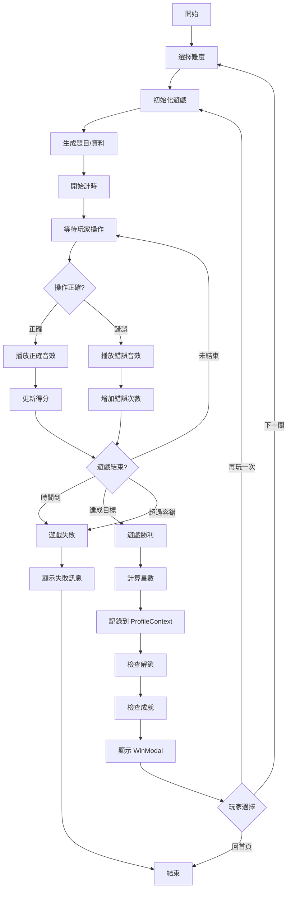

# 📊 兒童遊戲樂園系統分析設計書

## 文件資訊

| 項目 | 內容 |
|------|------|
| **專案名稱** | 兒童遊戲樂園 (Kids Games Playground) |
| **版本** | 1.0.0 |
| **文件類型** | 系統分析設計書 |
| **編寫日期** | 2026-02-28 |
| **目標用戶** | 2~6 歲幼兒及其家長 |
| **開發團隊** | 前端開發團隊 |
| **技術架構** | React 19 + Vite 7 SPA |

---

## 📑 目錄

1. [專案概述](#1-專案概述)
2. [需求分析](#2-需求分析)
3. [系統架構設計](#3-系統架構設計)
4. [資料庫設計](#4-資料庫設計)
5. [介面設計](#5-介面設計)
6. [功能模組設計](#6-功能模組設計)
7. [系統流程設計](#7-系統流程設計)
8. [安全性設計](#8-安全性設計)
9. [效能設計](#9-效能設計)
10. [測試計畫](#10-測試計畫)
11. [部署架構](#11-部署架構)
12. [維護計畫](#12-維護計畫)

---

## 1. 專案概述

### 1.1 專案背景

隨著數位學習的普及，幼兒教育逐漸結合科技工具。本專案旨在開發一個**免費、無廣告、重視隱私**的互動式學習平台，讓 2~6 歲幼兒透過遊戲方式學習基礎知識，包括顏色、形狀、數字、字母、注音、中文字和基礎運算。

### 1.2 專案目標

- **教育目標**：提供符合幼兒認知發展的互動學習內容
- **技術目標**：建立純前端、無需後端的 SPA 應用
- **隱私目標**：所有資料僅存本地，不收集個人資訊
- **體驗目標**：提供流暢、有趣、鼓勵式的學習體驗

### 1.3 系統特色

| 特色 | 說明 |
|------|------|
| 🎮 **9 款互動遊戲** | 涵蓋多種學習主題，適合不同年齡層 |
| 👤 **多用戶檔案** | 支援多位兒童獨立使用，各自記錄進度 |
| 🗺️ **學習路徑** | 依照學習拓樸設計，循序漸進解鎖遊戲 |
| 🏆 **五級難度** | 從初級到大師，逐步提升挑戰 |
| 🎖️ **成就系統** | 自動解鎖成就徽章，激勵持續學習 |
| 📊 **學習履歷** | 完整記錄每次遊戲表現與進度 |
| 🔊 **音效互動** | Web Audio API 即時音效回饋 |
| 🗣️ **語音朗讀** | Web Speech API 語音說明 |
| 📱 **RWD 設計** | 適配手機、平板、桌面裝置 |
| ✅ **高品質** | 完整單元測試，確保穩定性 |

### 1.4 適用範圍

- **設備**：桌機、筆電、平板、手機（建議使用 Chrome/Edge/Safari）
- **網路**：首次載入需網路，之後可離線使用
- **儲存**：瀏覽器 localStorage（約 5-10 MB）
- **年齡**：2~6 歲幼兒（建議家長陪同）

---

## 2. 需求分析

### 2.1 功能性需求

#### 2.1.1 用戶管理

| 需求編號 | 功能 | 優先級 | 說明 |
|---------|------|--------|------|
| FR-UM-001 | 建立學習檔案 | ⭐⭐⭐ | 輸入姓名、選擇頭像、設定年齡 |
| FR-UM-002 | 切換學習檔案 | ⭐⭐⭐ | 多用戶快速切換 |
| FR-UM-003 | 刪除學習檔案 | ⭐⭐ | 移除用戶資料 |
| FR-UM-004 | 檔案資訊顯示 | ⭐⭐⭐ | 顯示頭像、姓名、年齡、總星數 |
| FR-UM-005 | 年齡分級 | ⭐⭐⭐ | 根據年齡推薦合適遊戲 |

#### 2.1.2 遊戲系統

| 需求編號 | 功能 | 優先級 | 說明 |
|---------|------|--------|------|
| FR-GM-001 | 顏色配對遊戲 | ⭐⭐⭐ | 翻牌記憶，配對相同顏色 |
| FR-GM-002 | 動物翻翻樂遊戲 | ⭐⭐⭐ | 記憶翻牌，配對相同動物 |
| FR-GM-003 | 數字氣球遊戲 | ⭐⭐⭐ | 按順序戳破數字氣球 |
| FR-GM-004 | 形狀排排看遊戲 | ⭐⭐⭐ | 拖放形狀到正確位置 |
| FR-GM-005 | 數字學習遊戲 | ⭐⭐⭐ | 認識/配對/排序數字 (1~10) |
| FR-GM-006 | ABC 字母遊戲 | ⭐⭐⭐ | 學習/配對/排序英文字母 |
| FR-GM-007 | 注音符號遊戲 | ⭐⭐⭐ | 認識/配對/排序注音符號 |
| FR-GM-008 | 簡易加減法遊戲 | ⭐⭐⭐ | 5 以內到 50 以內加減法 |
| FR-GM-009 | 簡易中文字遊戲 | ⭐⭐⭐ | 象形文字認識與詞義配對 |

#### 2.1.3 難度系統

| 需求編號 | 功能 | 優先級 | 說明 |
|---------|------|--------|------|
| FR-DF-001 | 五級難度選擇 | ⭐⭐⭐ | 初級/中級/高級/專家/大師 |
| FR-DF-002 | 難度解鎖機制 | ⭐⭐⭐ | 拿到 2 星解鎖下一級 |
| FR-DF-003 | 難度參數配置 | ⭐⭐⭐ | 時間限制、題目數量、容錯次數 |
| FR-DF-004 | 最佳成績記錄 | ⭐⭐⭐ | 記錄各難度最高星數 |
| FR-DF-005 | 通關次數統計 | ⭐⭐ | 記錄各難度玩過次數 |

#### 2.1.4 進度管理

| 需求編號 | 功能 | 優先級 | 說明 |
|---------|------|--------|------|
| FR-PG-001 | 遊戲解鎖系統 | ⭐⭐⭐ | 依學習拓樸解鎖新遊戲 |
| FR-PG-002 | 星星評分系統 | ⭐⭐⭐ | 1~3 星評分機制 |
| FR-PG-003 | 學習履歷記錄 | ⭐⭐⭐ | 記錄遊戲時間、得分、星數 |
| FR-PG-004 | 成就徽章系統 | ⭐⭐ | 自動解鎖成就（6 種徽章）|
| FR-PG-005 | 總星數統計 | ⭐⭐⭐ | 累計所有遊戲星數 |
| FR-PG-006 | 遊戲次數統計 | ⭐⭐ | 累計遊戲場次 |

#### 2.1.5 互動系統

| 需求編號 | 功能 | 優先級 | 說明 |
|---------|------|--------|------|
| FR-IX-001 | 音效回饋 | ⭐⭐⭐ | 正確/錯誤/點擊/勝利音效 |
| FR-IX-002 | 語音朗讀 | ⭐⭐ | 題目與說明語音播放 |
| FR-IX-003 | 動畫效果 | ⭐⭐ | 淡入/彈跳/搖晃/脈衝動畫 |
| FR-IX-004 | 勝利慶祝 | ⭐⭐⭐ | 過關時撒花動畫 |
| FR-IX-005 | 觸控優化 | ⭐⭐⭐ | 大按鈕、易觸控設計 |

#### 2.1.6 頁面導航

| 需求編號 | 功能 | 優先級 | 說明 |
|---------|------|--------|------|
| FR-NV-001 | 首頁遊戲選單 | ⭐⭐⭐ | 顯示所有遊戲與解鎖狀態 |
| FR-NV-002 | 學習路徑地圖 | ⭐⭐⭐ | 視覺化學習拓樸與進度 |
| FR-NV-003 | 學習履歷頁面 | ⭐⭐⭐ | 顯示歷史記錄 |
| FR-NV-004 | 關於頁面 | ⭐⭐ | 專案說明與使用指南 |
| FR-NV-005 | 返回首頁按鈕 | ⭐⭐⭐ | 所有頁面可快速返回 |

### 2.2 非功能性需求

#### 2.2.1 效能需求

| 需求編號 | 指標 | 目標值 | 說明 |
|---------|------|--------|------|
| NFR-PF-001 | 首屏載入時間 | < 2 秒 | 首次載入完成時間 |
| NFR-PF-002 | 頁面切換時間 | < 300 毫秒 | 路由切換響應時間 |
| NFR-PF-003 | 動畫流暢度 | 60 FPS | 動畫幀率 |
| NFR-PF-004 | 音效延遲 | < 50 毫秒 | 點擊到播放音效延遲 |
| NFR-PF-005 | 記憶體使用 | < 100 MB | 運行時記憶體占用 |

#### 2.2.2 可用性需求

| 需求編號 | 指標 | 目標值 | 說明 |
|---------|------|--------|------|
| NFR-UX-001 | 學習曲線 | < 5 分鐘 | 首次使用學習時間 |
| NFR-UX-002 | 錯誤容忍度 | 100% | 操作錯誤不中斷遊戲 |
| NFR-UX-003 | 色彩對比度 | WCAG AA | 符合無障礙標準 |
| NFR-UX-004 | 按鈕最小尺寸 | 60×60 px | 符合觸控標準 |
| NFR-UX-005 | 字體最小尺寸 | 18px | 易於閱讀 |

#### 2.2.3 相容性需求

| 需求編號 | 平台 | 支援版本 | 說明 |
|---------|------|---------|------|
| NFR-CP-001 | Chrome | ≥ 90 | 主要支援瀏覽器 |
| NFR-CP-002 | Edge | ≥ 90 | 主要支援瀏覽器 |
| NFR-CP-003 | Safari | ≥ 14 | 主要支援瀏覽器 |
| NFR-CP-004 | Firefox | ≥ 88 | 次要支援瀏覽器 |
| NFR-CP-005 | 螢幕解析度 | 320px ~ 2560px | 響應式設計 |

#### 2.2.4 安全性需求

| 需求編號 | 要求 | 說明 |
|---------|------|------|
| NFR-SC-001 | 無資料外傳 | 所有資料僅存 localStorage |
| NFR-SC-002 | XSS 防護 | 使用 React 自動跳脫 |
| NFR-SC-003 | HTTPS 部署 | GitHub Pages 強制 HTTPS |
| NFR-SC-004 | 無第三方追蹤 | 不使用 GA、Facebook Pixel |
| NFR-SC-005 | CSP 政策 | 設定內容安全政策 |

#### 2.2.5 維護性需求

| 需求編號 | 要求 | 說明 |
|---------|------|------|
| NFR-MT-001 | 測試覆蓋率 | ≥ 80% | 程式碼測試覆蓋率 |
| NFR-MT-002 | 文件完整性 | 100% | 所有模組須有文件 |
| NFR-MT-003 | 程式碼註解 | ≥ 20% | 關鍵邏輯須有註解 |
| NFR-MT-004 | ESLint 檢查 | 0 錯誤 | 符合程式碼規範 |
| NFR-MT-005 | 模組化設計 | 100% | 元件可獨立測試 |

---

## 3. 系統架構設計

### 3.1 整體架構

```
┌─────────────────────────────────────────────────────────┐
│                    使用者介面層 (UI Layer)                │
│  ┌─────────────┐  ┌─────────────┐  ┌─────────────┐    │
│  │   頁面元件   │  │  共用元件    │  │  遊戲元件    │    │
│  │  (Pages)    │  │(Components) │  │   (Games)   │    │
│  └─────────────┘  └─────────────┘  └─────────────┘    │
└─────────────────────────────────────────────────────────┘
                            ↓
┌─────────────────────────────────────────────────────────┐
│                   路由管理層 (Router Layer)               │
│                    React Router DOM v7                   │
└─────────────────────────────────────────────────────────┘
                            ↓
┌─────────────────────────────────────────────────────────┐
│                   狀態管理層 (State Layer)                │
│  ┌─────────────────────────────────────────────────┐   │
│  │           ProfileContext (用戶與進度管理)         │   │
│  │  • 用戶檔案管理  • 關卡進度  • 遊戲解鎖           │   │
│  │  • 成就系統     • 學習履歷  • localStorage 同步  │   │
│  └─────────────────────────────────────────────────┘   │
└─────────────────────────────────────────────────────────┘
                            ↓
┌─────────────────────────────────────────────────────────┐
│                   業務邏輯層 (Business Layer)             │
│  ┌──────────────┐  ┌──────────────┐  ┌──────────────┐ │
│  │  遊戲邏輯     │  │  評分邏輯     │  │  解鎖邏輯     │ │
│  │ Game Logic   │  │Score System  │  │Unlock Rules  │ │
│  └──────────────┘  └──────────────┘  └──────────────┘ │
└─────────────────────────────────────────────────────────┘
                            ↓
┌─────────────────────────────────────────────────────────┐
│                   服務層 (Service Layer)                  │
│  ┌──────────────┐  ┌──────────────┐  ┌──────────────┐ │
│  │  音效服務     │  │  語音服務     │  │  儲存服務     │ │
│  │  useSound    │  │  useSpeak    │  │ localStorage │ │
│  └──────────────┘  └──────────────┘  └──────────────┘ │
└─────────────────────────────────────────────────────────┘
                            ↓
┌─────────────────────────────────────────────────────────┐
│                   瀏覽器 API 層 (Web API)                 │
│  • Web Audio API  • Web Speech API  • localStorage API  │
│  • Canvas API (confetti)  • History API (routing)       │
└─────────────────────────────────────────────────────────┘
```

### 3.2 前端架構

#### 3.2.1 技術棧

```
React 19 (UI 框架)
    ↓
React Router DOM 7 (路由管理)
    ↓
Context API (全域狀態管理)
    ↓
SCSS Modules (樣式管理)
    ↓
Vite 7 (建構工具)
```

#### 3.2.2 資料夾結構

```
src/
├── App.jsx                          # 應用程式入口、路由配置
├── main.jsx                         # React 掛載點
│
├── contexts/                        # Context API 狀態管理
│   └── ProfileContext.jsx           # 用戶檔案與進度管理
│
├── components/                      # 共用元件
│   ├── BackButton/                  # 返回按鈕
│   ├── LevelSelect/                 # 難度選擇介面
│   ├── ProfileBar/                  # 用戶資訊列
│   ├── ProfileSelect/               # 用戶選擇介面
│   ├── StarScore/                   # 星星評分顯示
│   └── WinModal/                    # 勝利彈窗
│
├── games/                           # 遊戲模組
│   ├── ColorMatch/                  # 🎨 顏色配對
│   ├── AnimalPuzzle/                # 🦁 動物翻翻樂
│   ├── BalloonPop/                  # 🎈 數字氣球
│   ├── ShapeSort/                   # 🔷 形狀排排看
│   ├── NumberLearn/                 # 🔢 數字學習
│   ├── ABCLearn/                    # 🔤 ABC 字母
│   ├── ZhuyinLearn/                 # ㄅ 注音符號
│   ├── MathBasic/                   # ➕ 簡易加減法
│   └── ChineseChar/                 # 漢 簡易中文字
│
├── pages/                           # 頁面元件
│   ├── Home/                        # 首頁遊戲選單
│   ├── LearningMap/                 # 學習路徑地圖
│   ├── History/                     # 學習履歷
│   └── About/                       # 關於頁面
│
├── hooks/                           # 自訂 Hooks
│   ├── useSound.js                  # 音效系統
│   ├── useSpeak.js                  # 語音系統
│   └── useProgress.js               # 進度管理（可選）
│
├── styles/                          # 全域樣式
│   ├── _variables.scss              # SCSS 變數
│   ├── _mixins.scss                 # SCSS Mixins
│   ├── _animations.scss             # 動畫定義
│   └── global.scss                  # 全域樣式
│
└── test/                            # 單元測試
    ├── setup.js                     # 測試環境設定
    └── ...                          # 測試檔案（映射 src/ 結構）
```

### 3.3 元件架構

#### 3.3.1 元件層級關係

```
App (ProfileProvider)
├── ProfileSelect                    # 用戶選擇頁面
│   ├── ProfileCard (多個)           # 用戶卡片
│   └── CreateProfileForm            # 新增用戶表單
│
└── AppContent (已選擇用戶)
    ├── ProfileBar                   # 頂部用戶資訊列
    │
    ├── Home                         # 首頁
    │   └── GameCard (多個)          # 遊戲卡片
    │
    ├── LearningMap                  # 學習地圖
    │   └── GameNode (多個)          # 遊戲節點
    │
    ├── History                      # 履歷頁面
    │   └── HistoryItem (多個)       # 履歷項目
    │
    ├── About                        # 關於頁面
    │
    └── Game Component               # 遊戲元件
        ├── LevelSelect              # 難度選擇
        ├── GameHeader               # 遊戲資訊列
        ├── GameContent              # 遊戲主體
        ├── BackButton               # 返回按鈕
        └── WinModal                 # 勝利彈窗
```

### 3.4 資料流架構

```
User Action (用戶操作)
    ↓
Event Handler (事件處理)
    ↓
State Update (狀態更新)
    ↓
Context API (全域狀態同步)
    ↓
localStorage (持久化儲存)
    ↓
Re-render (重新渲染)
    ↓
UI Update (介面更新)
    ↓
Audio/Visual Feedback (音效/視覺回饋)
```

---

## 4. 資料庫設計

### 4.1 資料儲存策略

本系統採用 **localStorage** 作為唯一的資料儲存方案，不使用後端資料庫。

**選擇 localStorage 的原因：**
- ✅ 無需後端伺服器（降低成本）
- ✅ 資料隱私（不外傳）
- ✅ 離線可用（無需網路）
- ✅ 讀寫速度快（毫秒級）
- ✅ 適合單機應用（5~10MB 容量足夠）

**限制與考量：**
- ⚠️ 清除瀏覽器資料會遺失記錄
- ⚠️ 無法跨裝置同步
- ⚠️ 儲存容量限制（約 5~10MB）

### 4.2 資料模型設計

#### 4.2.1 用戶檔案資料結構 (Profile)

```typescript
interface Profile {
  // === 基本資訊 ===
  id: string                    // 用戶唯一識別碼 (例: "profile-1234567890")
  name: string                  // 姓名 (例: "小明")
  avatar: string                // Emoji 頭像 (例: "🧒")
  age: number                   // 年齡 (2~6)
  createdAt: string             // ISO 8601 日期字串
  
  // === 進度資訊 ===
  levelProgress: {
    [gameId: string]: {
      beginner: number          // 初級通過次數
      intermediate: number      // 中級通過次數
      advanced: number          // 高級通過次數
      expert: number            // 專家通過次數
      master: number            // 大師通過次數
      bestStars: {              // 最佳星數記錄
        beginner?: number       // 初級最高星數 (0~3)
        intermediate?: number
        advanced?: number
        expert?: number
        master?: number
      }
      intermediateUnlocked?: boolean    // 中級已解鎖
      advancedUnlocked?: boolean        // 高級已解鎖
      expertUnlocked?: boolean          // 專家已解鎖
      masterUnlocked?: boolean          // 大師已解鎖
    }
  }
  
  // === 解鎖狀態 ===
  unlockedGames: string[]       // 已解鎖遊戲 ID 列表
  
  // === 統計資料 ===
  totalStars: number            // 累計獲得星數
  gamesPlayed: number           // 累計遊戲場次
  lastPlayed: string | null     // 最後遊玩時間 (ISO 8601)
  
  // === 學習履歷 ===
  history: HistoryEntry[]       // 遊戲記錄陣列（最多 200 筆）
  
  // === 成就系統 ===
  achievements: string[]        // 已解鎖成就 ID 列表
}
```

**範例資料：**

```json
{
  "id": "profile-1709136000000",
  "name": "小明",
  "avatar": "🧒",
  "age": 4,
  "createdAt": "2024-02-28T12:00:00.000Z",
  "levelProgress": {
    "color-match": {
      "beginner": 5,
      "intermediate": 2,
      "advanced": 0,
      "expert": 0,
      "master": 0,
      "bestStars": {
        "beginner": 3,
        "intermediate": 2
      },
      "intermediateUnlocked": true,
      "advancedUnlocked": false
    },
    "number-learn": {
      "beginner": 3,
      "intermediate": 0,
      "advanced": 0,
      "expert": 0,
      "master": 0,
      "bestStars": {
        "beginner": 2
      },
      "intermediateUnlocked": true
    }
  },
  "unlockedGames": [
    "color-match",
    "shape-sort",
    "animal-puzzle",
    "balloon-pop",
    "number-learn"
  ],
  "totalStars": 45,
  "gamesPlayed": 20,
  "lastPlayed": "2024-02-28T15:30:00.000Z",
  "history": [
    {
      "id": 1709140200000,
      "gameId": "color-match",
      "gameName": "顏色配對",
      "stars": 3,
      "details": "得分：100",
      "level": "beginner",
      "date": "2024-02-28T15:30:00.000Z"
    }
  ],
  "achievements": [
    "first-game",
    "ten-games",
    "perfect-game"
  ]
}
```

#### 4.2.2 學習履歷項目 (HistoryEntry)

```typescript
interface HistoryEntry {
  id: number              // 時間戳記（唯一識別碼）
  gameId: string          // 遊戲 ID (例: "color-match")
  gameName: string        // 遊戲名稱 (例: "顏色配對")
  stars: number           // 獲得星數 (1~3)
  details: string         // 詳細資訊 (例: "得分：100")
  level: string           // 難度級別 (beginner/intermediate/advanced/expert/master)
  date: string            // ISO 8601 日期字串
}
```

#### 4.2.3 成就定義 (Achievement)

```typescript
interface Achievement {
  id: string              // 成就 ID
  emoji: string           // 成就圖示
  title: string           // 成就名稱
  desc: string            // 成就說明
}
```

**成就列表：**

| ID | Emoji | 名稱 | 說明 | 觸發條件 |
|----|-------|------|------|---------|
| `first-game` | 🎉 | 初次冒險 | 完成第一個遊戲 | `gamesPlayed === 1` |
| `ten-games` | 🔥 | 遊戲達人 | 完成 10 個遊戲 | `gamesPlayed >= 10` |
| `fifty-stars` | 🌟 | 星星收藏家 | 累積 50 顆星星 | `totalStars >= 50` |
| `perfect-game` | 👑 | 完美通關 | 獲得 3 顆星 | `stars === 3` |
| `explorer` | 🗺️ | 探險家 | 嘗試所有遊戲 | `uniqueGames >= 9` |
| `master` | 🏅 | 大師 | 所有遊戲高級過關 | `advancedCleared >= 9` |

#### 4.2.4 難度等級定義 (DifficultyLevel)

```typescript
interface DifficultyLevel {
  label: string           // 顯示名稱
  emoji: string           // 等級圖示
  color: string           // 主題色彩
  description: string     // 等級說明
}
```

**難度列表：**

| Key | Label | Emoji | Color | Description |
|-----|-------|-------|-------|-------------|
| `beginner` | 初級 | ⭐ | #4ECDC4 | 基礎入門 |
| `intermediate` | 中級 | ⭐⭐ | #60A5FA | 進階挑戰 |
| `advanced` | 高級 | ⭐⭐⭐ | #FB923C | 高手過招 |
| `expert` | 專家 | 🌟 | #E040FB | 專家級別 |
| `master` | 大師 | 👑 | #FF6B6B | 最終挑戰 |

#### 4.2.5 遊戲配置 (GameConfig)

```typescript
interface GameConfig {
  id: string              // 遊戲 ID (例: "color-match")
  name: string            // 遊戲名稱 (例: "顏色配對")
  emoji: string           // 遊戲圖示 (例: "🎨")
  description: string     // 遊戲說明
  category: string        // 分類 (learning/fun)
  ageRange: [number, number]  // 適合年齡 [min, max]
  color: string           // 主題色彩
  path: string            // 路由路徑
  prerequisites: string[] // 前置遊戲 ID 列表
  skills: string[]        // 訓練技能標籤
}
```

### 4.3 localStorage 儲存鍵值

| Key | 型別 | 說明 |
|-----|------|------|
| `kids-playground-profiles` | `Profile[]` | 所有用戶檔案陣列（JSON 字串） |
| `kids-playground-active-profile` | `string` | 目前啟用的用戶 ID |

### 4.4 資料存取模式

#### 4.4.1 讀取資料

```javascript
// 讀取所有用戶檔案
const profiles = JSON.parse(localStorage.getItem('kids-playground-profiles') || '[]')

// 讀取當前啟用用戶
const activeProfileId = localStorage.getItem('kids-playground-active-profile')
```

#### 4.4.2 儲存資料

```javascript
// 儲存所有用戶檔案
localStorage.setItem('kids-playground-profiles', JSON.stringify(profiles))

// 儲存當前啟用用戶
localStorage.setItem('kids-playground-active-profile', profileId)
```

#### 4.4.3 刪除資料

```javascript
// 刪除特定鍵值
localStorage.removeItem('kids-playground-active-profile')

// 清空所有資料
localStorage.clear()
```

### 4.5 資料完整性保護

```javascript
// 讀取時加入錯誤處理
function loadProfiles() {
  try {
    const saved = localStorage.getItem('kids-playground-profiles')
    const profiles = saved ? JSON.parse(saved) : []
    // 驗證資料結構
    return profiles.filter(p => p.id && p.name)
  } catch (error) {
    console.error('載入用戶檔案失敗', error)
    return []
  }
}

// 儲存時加入錯誤處理
function saveProfiles(profiles) {
  try {
    localStorage.setItem('kids-playground-profiles', JSON.stringify(profiles))
    return true
  } catch (error) {
    console.error('儲存用戶檔案失敗', error)
    // 可能原因：儲存空間不足、隱私模式
    return false
  }
}
```

---

## 5. 介面設計

### 5.1 設計原則

#### 5.1.1 兒童友善設計 (Child-Friendly Design)

| 原則 | 實作方式 |
|------|---------|
| **大型觸控目標** | 按鈕最小尺寸 60×60px |
| **明亮色彩** | 飽和度高的顏色（HSB: S>60%, B>70%） |
| **Emoji 圖示** | 直覺易懂、跨語言理解 |
| **圓角設計** | 溫和友善感（border-radius: 20px+） |
| **大字體** | 18px 以上，易於閱讀 |
| **高對比度** | 文字與背景對比度 ≥ 4.5:1 |
| **即時回饋** | 點擊立即音效/動畫回應 |
| **正向鼓勵** | 錯誤不懲罰，鼓勵再試 |

#### 5.1.2 色彩系統

**主色調：**

| 用途 | 色彩 | Hex | 應用場景 |
|------|------|-----|---------|
| 主要色 | 珊瑚紅 | `#FF6B6B` | 強調、CTA 按鈕 |
| 次要色 | 薄荷綠 | `#4ECDC4` | 初級、成功提示 |
| 強調色 | 陽光黃 | `#FFE66D` | 星星、獎勵 |
| 薰衣草紫 | `#A78BFA` | 專家級、進階功能 |
| 天空藍 | `#60A5FA` | 中級、資訊提示 |
| 櫻花粉 | `#F472B6` | 女孩偏好 |
| 活力橙 | `#FB923C` | 高級、警告 |
| 草地綠 | `#34D399` | 初級、安全 |

**背景漸層：**

```scss
$bg-gradient-sky: linear-gradient(180deg, #87CEEB 0%, #E0F7FA 50%, #FFF8E1 100%);
$bg-gradient-sunset: linear-gradient(135deg, #FFB347 0%, #FF6B6B 50%, #A78BFA 100%);
$bg-gradient-candy: linear-gradient(135deg, #F472B6 0%, #A78BFA 50%, #60A5FA 100%);
```

#### 5.1.3 字體系統

| 層級 | 尺寸 | 行高 | 用途 |
|------|------|------|------|
| H1 | 32px ~ 48px | 1.2 | 頁面標題 |
| H2 | 24px ~ 36px | 1.3 | 區塊標題 |
| H3 | 20px ~ 28px | 1.4 | 卡片標題 |
| Body | 16px ~ 18px | 1.6 | 內文 |
| Small | 14px | 1.5 | 輔助文字 |

**字體家族：**

```scss
$font-family: 'Noto Sans TC', -apple-system, BlinkMacSystemFont, sans-serif;
```

#### 5.1.4 間距系統

```scss
$spacing-xs: 4px;    // 極小間距
$spacing-sm: 8px;    // 小間距
$spacing-md: 16px;   // 中間距（基準）
$spacing-lg: 24px;   // 大間距
$spacing-xl: 32px;   // 特大間距
$spacing-2xl: 48px;  // 超大間距
```

### 5.2 頁面設計

#### 5.2.1 用戶選擇頁面 (ProfileSelect)

**功能：**
- 顯示所有用戶檔案卡片
- 新增用戶按鈕
- 選擇用戶進入系統

**佈局：**

```
┌────────────────────────────────────────┐
│         🎪 兒童遊戲樂園                  │
│      選擇你的學習護照                     │
├────────────────────────────────────────┤
│  ┌──────┐  ┌──────┐  ┌──────┐  ┌────┐│
│  │ 🧒   │  │ 👧   │  │ 🧑   │  │ ➕  ││
│  │ 小明 │  │ 小美 │  │ 小華 │  │新增 ││
│  │ 4歲  │  │ 5歲  │  │ 6歲  │  │    ││
│  │⭐ 45 │  │⭐ 32 │  │⭐ 67 │  │    ││
│  └──────┘  └──────┘  └──────┘  └────┘│
└────────────────────────────────────────┘
```

**元件結構：**

```jsx
<div className="profile-select">
  <header className="profile-select__header">
    <h1>🎪 兒童遊戲樂園</h1>
    <p>選擇你的學習護照</p>
  </header>
  
  <div className="profile-select__cards">
    {profiles.map(profile => (
      <ProfileCard key={profile.id} profile={profile} />
    ))}
    <CreateProfileButton />
  </div>
</div>
```

#### 5.2.2 首頁遊戲選單 (Home)

**功能：**
- 顯示所有遊戲卡片
- 顯示鎖定/解鎖狀態
- 顯示最佳星數
- 快速進入遊戲

**佈局：**

```
┌────────────────────────────────────────┐
│ 🧒 小明 (4歲) ⭐ 45      [學習地圖] [履歷]│
├────────────────────────────────────────┤
│            🎮 選擇遊戲                   │
├────────────────────────────────────────┤
│  ┌────────┐  ┌────────┐  ┌────────┐   │
│  │  🎨    │  │  🦁    │  │  🎈    │   │
│  │顏色配對│  │動物翻翻樂│  │數字氣球│   │
│  │ ⭐⭐⭐  │  │  ⭐⭐   │  │  🔒    │   │
│  └────────┘  └────────┘  └────────┘   │
│  ┌────────┐  ┌────────┐  ┌────────┐   │
│  │  🔷    │  │  🔢    │  │  🔤    │   │
│  │形狀排排看│  │數字學習│  │ ABC字母│   │
│  │  ⭐⭐   │  │  ⭐⭐   │  │  ⭐    │   │
│  └────────┘  └────────┘  └────────┘   │
└────────────────────────────────────────┘
```

#### 5.2.3 難度選擇頁面 (LevelSelect)

**功能：**
- 顯示五個難度等級
- 顯示鎖定/解鎖狀態
- 顯示各難度最佳星數
- 顯示解鎖條件提示

**佈局：**

```
┌────────────────────────────────────────┐
│  ← 返回                                 │
├────────────────────────────────────────┤
│              🎨 顏色配對                 │
│             選擇挑戰級別                  │
├────────────────────────────────────────┤
│  ┌────────────────────────────────┐   │
│  │ ⭐ 初級        基礎入門          │   │
│  │ ⭐⭐⭐  已玩 5 次                │   │
│  └────────────────────────────────┘   │
│  ┌────────────────────────────────┐   │
│  │ ⭐⭐ 中級      進階挑戰          │   │
│  │ ⭐⭐   已玩 2 次                │   │
│  └────────────────────────────────┘   │
│  ┌────────────────────────────────┐   │
│  │ ⭐⭐⭐ 高級    高手過招          │   │
│  │ 🔒  中級拿到2星解鎖              │   │
│  └────────────────────────────────┘   │
└────────────────────────────────────────┘
```

#### 5.2.4 遊戲進行頁面 (Game)

**佈局：**

```
┌────────────────────────────────────────┐
│  ← 返回          🎨 顏色配對 - 初級      │
├────────────────────────────────────────┤
│  得分: 80   錯誤: 1/5   時間: 45秒       │
├────────────────────────────────────────┤
│                                        │
│           [遊戲主要內容區]               │
│                                        │
│      (依各遊戲類型不同而異)               │
│                                        │
└────────────────────────────────────────┘
```

#### 5.2.5 勝利彈窗 (WinModal)

**佈局：**

```
┌────────────────────────────────────────┐
│                                        │
│              🏆                         │
│           恭喜過關！                     │
│                                        │
│         ⭐ ⭐ ⭐                         │
│                                        │
│         你好棒！繼續加油！                │
│                                        │
│  ┌──────────┐  ┌──────────┐          │
│  │ 🚀 下一關 │  │ 🔄 再玩一次│          │
│  └──────────┘  └──────────┘          │
│         ┌──────────┐                  │
│         │ 🏠 回首頁 │                  │
│         └──────────┘                  │
│                                        │
└────────────────────────────────────────┘
```

#### 5.2.6 學習履歷頁面 (History)

**佈局：**

```
┌────────────────────────────────────────┐
│ 🧒 小明 (4歲) ⭐ 45      [首頁] [學習地圖]│
├────────────────────────────────────────┤
│            📊 學習履歷                   │
├────────────────────────────────────────┤
│  2024/02/28 15:30                      │
│  🎨 顏色配對 - 初級   ⭐⭐⭐            │
│  得分：100                              │
├────────────────────────────────────────┤
│  2024/02/28 14:20                      │
│  🦁 動物翻翻樂 - 中級   ⭐⭐             │
│  得分：85                               │
├────────────────────────────────────────┤
│  2024/02/28 13:10                      │
│  🔢 數字學習 - 初級   ⭐⭐⭐            │
│  得分：100                              │
└────────────────────────────────────────┘
```

#### 5.2.7 學習路徑地圖 (LearningMap)

**佈局：**

```
┌────────────────────────────────────────┐
│ 🧒 小明 (4歲) ⭐ 45      [首頁] [履歷]   │
├────────────────────────────────────────┤
│           🗺️ 學習路徑地圖                │
├────────────────────────────────────────┤
│                                        │
│    🎨 ──→ 🦁                           │
│  顏色配對  動物翻翻樂                     │
│   ⭐⭐⭐    ⭐⭐                         │
│                                        │
│    🔷 ──→ 🎈 ──→ 🔢 ──→ 🔤 ──→ ㄅ ──→ 漢 │
│  形狀排  數字  數字   ABC  注音  中文字    │
│   ⭐⭐   ⭐⭐  ⭐⭐⭐  ⭐⭐  ⭐   🔒    │
│            └──→ ➕                     │
│               加減法                     │
│                ⭐⭐                     │
└────────────────────────────────────────┘
```

### 5.3 響應式設計

#### 5.3.1 斷點定義

```scss
// 手機（直向）
@media (max-width: 480px) { }

// 手機（橫向）/ 小平板
@media (min-width: 481px) and (max-width: 768px) { }

// 平板
@media (min-width: 769px) and (max-width: 1024px) { }

// 桌面
@media (min-width: 1025px) { }
```

#### 5.3.2 佈局調整

| 裝置 | 遊戲卡片佈局 | 按鈕尺寸 | 字體尺寸 |
|------|------------|---------|---------|
| 手機（< 480px） | 1 欄 | 60×60px | 16px |
| 手機橫/小平板 | 2 欄 | 64×64px | 17px |
| 平板 | 3 欄 | 68×68px | 18px |
| 桌面 | 3~4 欄 | 72×72px | 18px |

### 5.4 動畫設計

#### 5.4.1 進入動畫

```scss
// 彈跳進入
@keyframes bounce-in {
  0% {
    opacity: 0;
    transform: scale(0.3) translateY(-50px);
  }
  50% {
    transform: scale(1.05);
  }
  70% {
    transform: scale(0.9);
  }
  100% {
    opacity: 1;
    transform: scale(1) translateY(0);
  }
}

// 使用
.card {
  animation: bounce-in 0.6s cubic-bezier(0.68, -0.55, 0.265, 1.55);
}
```

#### 5.4.2 互動動畫

```scss
// 按鈕點擊
.button:active {
  transform: scale(0.92);
  transition: transform 0.1s;
}

// 搖晃（錯誤提示）
@keyframes shake {
  0%, 100% { transform: translateX(0); }
  10%, 30%, 50%, 70%, 90% { transform: translateX(-10px); }
  20%, 40%, 60%, 80% { transform: translateX(10px); }
}

// 脈衝（提示）
@keyframes pulse {
  0%, 100% {
    transform: scale(1);
    opacity: 1;
  }
  50% {
    transform: scale(1.1);
    opacity: 0.8;
  }
}
```

---

## 6. 功能模組設計

### 6.1 用戶管理模組 (ProfileContext)

#### 6.1.1 模組職責

- 管理所有用戶檔案（增刪改查）
- 記錄遊戲結果與進度
- 處理關卡與遊戲解鎖邏輯
- 同步 localStorage 資料
- 提供成就系統

#### 6.1.2 核心方法

```typescript
interface ProfileContextType {
  // === 狀態 ===
  profiles: Profile[]                    // 所有用戶檔案
  activeProfile: Profile | null          // 當前啟用用戶
  activeProfileId: string | null         // 當前用戶 ID
  
  // === 用戶管理 ===
  createProfile(name: string, avatar: string, age: number): string
  switchProfile(id: string): void
  deleteProfile(id: string): void
  updateProfile(id: string, updates: Partial<Profile>): void
  
  // === 進度管理 ===
  recordGame(
    gameId: string,
    gameName: string,
    stars: number,
    details: string,
    level: string
  ): void
  
  getGameStats(gameId: string): {
    totalPlayed: number
    bestStars: number
    avgStars: number
  }
  
  resetProgress(): void
}
```

#### 6.1.3 解鎖邏輯

**難度解鎖規則：**

```javascript
// 獲得 2 星或以上，自動解鎖下一難度
if (stars >= 2 && currentLevel !== 'master') {
  const nextLevel = getNextLevel(currentLevel)
  levelProgress[gameId][`${nextLevel}Unlocked`] = true
}
```

**遊戲解鎖規則：**

```javascript
const UNLOCK_RULES = [
  {
    gameId: 'animal-puzzle',
    requires: [
      { gameId: 'color-match', level: 'beginner', minStars: 2 }
    ]
  },
  {
    gameId: 'abc-learn',
    requires: [
      { gameId: 'number-learn', level: 'beginner', minStars: 2 },
      { gameId: 'animal-puzzle', level: 'beginner', minStars: 2 }
    ]
  }
]

// 檢查是否符合解鎖條件
function checkUnlock(gameId, levelProgress) {
  const rule = UNLOCK_RULES.find(r => r.gameId === gameId)
  if (!rule) return true
  
  return rule.requires.every(req => {
    const progress = levelProgress[req.gameId]
    if (!progress) return false
    const bestStars = progress.bestStars?.[req.level] || 0
    return bestStars >= req.minStars
  })
}
```

#### 6.1.4 成就系統

```javascript
// 成就觸發檢查
function checkAchievements(profile) {
  const achievements = [...profile.achievements]
  
  // 初次冒險：完成第一個遊戲
  if (profile.gamesPlayed === 1 && !achievements.includes('first-game')) {
    achievements.push('first-game')
  }
  
  // 遊戲達人：完成 10 個遊戲
  if (profile.gamesPlayed >= 10 && !achievements.includes('ten-games')) {
    achievements.push('ten-games')
  }
  
  // 星星收藏家：累積 50 顆星星
  if (profile.totalStars >= 50 && !achievements.includes('fifty-stars')) {
    achievements.push('fifty-stars')
  }
  
  // 完美通關：獲得 3 顆星
  if (stars === 3 && !achievements.includes('perfect-game')) {
    achievements.push('perfect-game')
  }
  
  // 探險家：嘗試所有遊戲
  const uniqueGames = new Set(profile.history.map(h => h.gameId)).size
  if (uniqueGames >= 9 && !achievements.includes('explorer')) {
    achievements.push('explorer')
  }
  
  // 大師：所有遊戲高級通關
  const advancedCleared = Object.values(profile.levelProgress)
    .filter(lp => lp.bestStars?.advanced >= 2).length
  if (advancedCleared >= 9 && !achievements.includes('master')) {
    achievements.push('master')
  }
  
  return achievements
}
```

### 6.2 音效系統模組 (useSound)

#### 6.2.1 模組職責

- 使用 Web Audio API 合成音效
- 提供正確/錯誤/點擊/勝利音效
- 無需外部音檔

#### 6.2.2 核心方法

```typescript
interface UseSoundReturn {
  playCorrect(): void     // 正確音效（上升音階）
  playWrong(): void       // 錯誤音效（低頻震動）
  playClick(): void       // 點擊音效（單音）
  playWin(): void         // 勝利音效（音階）
  playPop(): void         // 彈出音效（隨機音高）
}
```

#### 6.2.3 實作方式

```javascript
function playTone(frequency, duration, type, volume) {
  const audioCtx = new AudioContext()
  const osc = audioCtx.createOscillator()
  const gain = audioCtx.createGain()
  
  osc.type = type  // 'sine', 'square', 'triangle', 'sawtooth'
  osc.frequency.value = frequency
  gain.gain.value = volume
  gain.gain.exponentialRampToValueAtTime(0.01, audioCtx.currentTime + duration)
  
  osc.connect(gain)
  gain.connect(audioCtx.destination)
  osc.start()
  osc.stop(audioCtx.currentTime + duration)
}

// 正確音效（三個上升音符）
function playCorrect() {
  playTone(523, 0.1, 'sine', 0.3)  // C5
  setTimeout(() => playTone(659, 0.1, 'sine', 0.3), 100)  // E5
  setTimeout(() => playTone(784, 0.2, 'sine', 0.3), 200)  // G5
}
```

### 6.3 語音系統模組 (useSpeak)

#### 6.3.1 模組職責

- 使用 Web Speech API 朗讀文字
- 支援中文/英文語音
- 提供延遲播放功能

#### 6.3.2 核心方法

```typescript
interface UseSpeakReturn {
  speak(text: string, lang?: string): void
  speakZh(text: string): void
  speakEn(text: string): void
  speakDelayed(text: string, lang?: string, delay?: number): void
  stopSpeak(): void
}
```

#### 6.3.3 實作方式

```javascript
function speak(text, lang = 'zh-TW') {
  if (!window.speechSynthesis) return
  
  window.speechSynthesis.cancel()
  const utterance = new SpeechSynthesisUtterance(text)
  utterance.lang = lang
  utterance.rate = 0.8   // 語速（0.1 ~ 10）
  utterance.pitch = 1.1  // 音調（0 ~ 2）
  window.speechSynthesis.speak(utterance)
}
```

### 6.4 遊戲邏輯模組

#### 6.4.1 遊戲生命週期

```
初始化 (Init)
    ↓
選擇難度 (LevelSelect)
    ↓
載入遊戲配置 (Load Config)
    ↓
生成題目/資料 (Generate Data)
    ↓
開始遊戲 (Start)
    ↓
玩家操作 (Player Action)
    ↓
判斷正確/錯誤 (Validate)
    ↓
更新狀態 (Update State)
    ↓
檢查結束條件 (Check End)
    ↓
計算星數 (Calculate Stars)
    ↓
記錄結果 (Record Game)
    ↓
顯示勝利畫面 (Show Win Modal)
```

#### 6.4.2 難度配置範例

```javascript
const LEVEL_CONFIG = {
  beginner: {
    label: '初級',
    timeLimit: 60,      // 時間限制（秒）
    items: 4,           // 項目數量
    maxMistakes: 5,     // 最大容錯次數
    questionCount: 3    // 題目數量
  },
  intermediate: {
    label: '中級',
    timeLimit: 45,
    items: 6,
    maxMistakes: 4,
    questionCount: 5
  },
  advanced: {
    label: '高級',
    timeLimit: 30,
    items: 8,
    maxMistakes: 3,
    questionCount: 7
  },
  expert: {
    label: '專家',
    timeLimit: 25,
    items: 10,
    maxMistakes: 2,
    questionCount: 10
  },
  master: {
    label: '大師',
    timeLimit: 20,
    items: 12,
    maxMistakes: 1,
    questionCount: 12
  }
}
```

#### 6.4.3 星星計算邏輯

```javascript
function calculateStars(score, errors, timeLeft, maxTime, maxErrors) {
  const timeRatio = timeLeft / maxTime
  const errorRatio = errors / maxErrors
  
  // 3 星條件：零失誤 + 剩餘時間 > 50%
  if (errors === 0 && timeRatio > 0.5) {
    return 3
  }
  
  // 2 星條件：失誤 ≤ 2 + 剩餘時間 > 20%
  if (errors <= 2 && timeRatio > 0.2) {
    return 2
  }
  
  // 1 星條件：完成遊戲
  return 1
}
```

### 6.5 遊戲範例：數字學習

#### 6.5.1 遊戲模式

| 模式 | 說明 | 難度 |
|------|------|------|
| **認識模式** | 顯示物品，選擇數量 | 初級/中級 |
| **配對模式** | 數字與物品配對 | 中級/高級 |
| **排序模式** | 拖放數字排序 | 高級/專家/大師 |

#### 6.5.2 題目生成

```javascript
// 認識模式：數數看有幾個
function generateCountQuestion(numbers) {
  const num = numbers[Math.floor(Math.random() * numbers.length)]
  const emoji = ITEM_EMOJIS[Math.floor(Math.random() * ITEM_EMOJIS.length)]
  const items = Array(num).fill(emoji)
  
  // 生成選項（1 正確 + 3 錯誤）
  const choices = new Set([num])
  const candidates = []
  for (let i = Math.max(1, num - 3); i <= num + 3; i++) {
    if (i !== num) candidates.push(i)
  }
  for (const c of shuffleArray(candidates)) {
    if (choices.size >= 4) break
    choices.add(c)
  }
  
  return {
    items,
    emoji,
    correctAnswer: num,
    choices: shuffleArray([...choices]),
    question: `有幾個 ${emoji}？`
  }
}

// 排序模式：數字排序
function generateOrderQuestion(numbers) {
  return {
    type: 'order',
    numbers: shuffleArray([...numbers]),
    correctOrder: [...numbers].sort((a, b) => a - b)
  }
}
```

---

## 7. 系統流程設計

### 7.1 用戶使用流程

```
啟動應用
    ↓
載入 localStorage 資料
    ↓
是否有用戶檔案？
    ├─ 否 → 顯示歡迎頁面 → 建立第一個用戶檔案
    └─ 是 → 是否有啟用用戶？
              ├─ 否 → 顯示用戶選擇頁面 → 選擇/建立用戶
              └─ 是 → 進入首頁
                          ↓
                      選擇遊戲
                          ↓
                      選擇難度
                          ↓
                      進行遊戲
                          ↓
                      完成遊戲
                          ↓
                      記錄結果（星數、履歷、成就）
                          ↓
                      更新解鎖狀態
                          ↓
                      顯示勝利畫面
                          ↓
                      選擇：下一關 / 再玩一次 / 回首頁
```

### 7.2 遊戲流程



### 7.3 資料同步流程

```
用戶操作
    ↓
觸發事件處理函數
    ↓
呼叫 Context API 方法
    ↓
更新 React State
    ↓
觸發 useEffect
    ↓
同步寫入 localStorage
    ↓
重新渲染元件
    ↓
顯示更新後的 UI
```

### 7.4 錯誤處理流程

```
執行操作
    ↓
try {
    localStorage 操作
} catch (error) {
    ↓
    記錄錯誤到 console
    ↓
    顯示友善錯誤訊息
    ↓
    提供降級方案（不中斷遊戲）
}
```

---

## 8. 安全性設計

### 8.1 資料隱私保護

| 措施 | 說明 |
|------|------|
| **本地儲存** | 所有資料僅存 localStorage，不上傳伺服器 |
| **無追蹤** | 不使用 Google Analytics、Facebook Pixel 等追蹤工具 |
| **無 Cookie** | 不使用 Cookie 儲存資料 |
| **無第三方** | 不載入第三方分析/廣告腳本 |
| **HTTPS** | GitHub Pages 強制 HTTPS |

### 8.2 XSS 防護

```javascript
// React 自動跳脫 XSS
// 危險：直接插入 HTML
<div dangerouslySetInnerHTML={{__html: userInput}} />  // ❌ 避免使用

// 安全：React 自動跳脫
<div>{userInput}</div>  // ✅ 推薦方式
```

### 8.3 CSP 內容安全政策

```html
<!-- index.html -->
<meta http-equiv="Content-Security-Policy" content="
  default-src 'self';
  script-src 'self' 'unsafe-inline' 'unsafe-eval';
  style-src 'self' 'unsafe-inline';
  img-src 'self' data: blob:;
  font-src 'self' data:;
  connect-src 'self';
">
```

### 8.4 輸入驗證

```javascript
// 用戶名稱驗證
function validateProfileName(name) {
  if (!name || name.trim().length === 0) {
    return { valid: false, error: '請輸入名稱' }
  }
  if (name.length > 20) {
    return { valid: false, error: '名稱不能超過 20 個字' }
  }
  return { valid: true }
}

// 年齡驗證
function validateAge(age) {
  const ageNum = Number(age)
  if (!Number.isInteger(ageNum) || ageNum < 2 || ageNum > 6) {
    return { valid: false, error: '年齡必須是 2~6 歲' }
  }
  return { valid: true }
}
```

### 8.5 localStorage 容量管理

```javascript
// 檢查儲存空間
function checkStorageSpace() {
  try {
    const test = 'test'
    localStorage.setItem(test, test)
    localStorage.removeItem(test)
    return true
  } catch (e) {
    if (e.name === 'QuotaExceededError') {
      console.error('localStorage 空間不足')
      return false
    }
    return false
  }
}

// 限制履歷記錄數量（最多 200 筆）
const newHistory = [entry, ...profile.history].slice(0, 200)
```

---

## 9. 效能設計

### 9.1 載入效能優化

| 策略 | 實作方式 | 預期效果 |
|------|---------|---------|
| **Code Splitting** | React.lazy + Suspense | 減少首屏載入 50% |
| **Tree Shaking** | Vite 自動移除未使用程式碼 | 減少 bundle 大小 20% |
| **Minify** | Terser 壓縮 | 減少檔案大小 30% |
| **Gzip** | GitHub Pages 自動啟用 | 減少傳輸大小 70% |
| **Preload** | 關鍵資源預載入 | 提升首屏速度 |

#### 9.1.1 Code Splitting 範例

```javascript
// App.jsx
import { lazy, Suspense } from 'react'

const Home = lazy(() => import('./pages/Home/Home'))
const ColorMatch = lazy(() => import('./games/ColorMatch/ColorMatch'))

function App() {
  return (
    <Suspense fallback={<div>載入中...</div>}>
      <Routes>
        <Route path="/" element={<Home />} />
        <Route path="/color-match" element={<ColorMatch />} />
      </Routes>
    </Suspense>
  )
}
```

### 9.2 渲染效能優化

```javascript
// 使用 React.memo 防止不必要的重渲染
const GameCard = React.memo(({ game }) => {
  return <div>{game.name}</div>
})

// 使用 useCallback 快取函數
const handleClick = useCallback(() => {
  playClick()
  navigate(game.path)
}, [game.path, playClick, navigate])

// 使用 useMemo 快取計算結果
const sortedHistory = useMemo(() => {
  return history.sort((a, b) => b.date - a.date)
}, [history])
```

### 9.3 localStorage 效能優化

```javascript
// 防抖寫入（避免頻繁寫入）
const debouncedSave = useCallback(
  debounce((data) => {
    localStorage.setItem('key', JSON.stringify(data))
  }, 500),
  []
)

// 批次更新（一次更新多個狀態）
setProfiles(prev => {
  const updated = prev.map(p => {
    if (p.id === activeProfileId) {
      return {
        ...p,
        totalStars: p.totalStars + stars,
        gamesPlayed: p.gamesPlayed + 1,
        history: [entry, ...p.history]
      }
    }
    return p
  })
  return updated
})
```

### 9.4 動畫效能優化

```scss
// 使用 transform 和 opacity（觸發 GPU 加速）
.card {
  transition: transform 0.3s, opacity 0.3s;  // ✅ 推薦
  // 避免使用 left, top, width, height       // ❌ 避免
}

// 使用 will-change 提示瀏覽器
.animated-card {
  will-change: transform;
}
```

### 9.5 圖片優化

```javascript
// 使用 Emoji 取代圖片（無需載入圖檔）
const GAME_EMOJIS = {
  'color-match': '🎨',
  'animal-puzzle': '🦁',
  'balloon-pop': '🎈'
}

// 如需圖片，使用 WebP 格式
<picture>
  <source srcSet="image.webp" type="image/webp" />
  
</picture>
```

### 9.6 效能監控

```javascript
// 使用 Performance API 監控
function measurePerformance() {
  const perfData = window.performance.timing
  const pageLoadTime = perfData.loadEventEnd - perfData.navigationStart
  console.log('頁面載入時間:', pageLoadTime, 'ms')
}

// React Profiler
import { Profiler } from 'react'

function onRenderCallback(id, phase, actualDuration) {
  console.log(`${id} (${phase}) took ${actualDuration}ms`)
}

<Profiler id="Game" onRender={onRenderCallback}>
  <GameComponent />
</Profiler>
```

---

## 10. 測試計畫

### 10.1 測試策略

| 測試類型 | 目標覆蓋率 | 工具 | 頻率 |
|---------|-----------|------|------|
| **單元測試** | ≥ 80% | Vitest | 每次提交 |
| **整合測試** | ≥ 60% | Testing Library | 每個功能 |
| **E2E 測試** | 主流程 | Playwright (可選) | 發布前 |
| **手動測試** | 全功能 | 人工測試 | 發布前 |

### 10.2 測試範圍

#### 10.2.1 單元測試

```
✅ Hooks
  ├─ useSound.test.js
  ├─ useSpeak.test.js
  └─ useProgress.test.js

✅ Components
  ├─ BackButton.test.jsx
  ├─ StarScore.test.jsx
  ├─ WinModal.test.jsx
  └─ LevelSelect.test.jsx

✅ Contexts
  └─ ProfileContext.test.jsx

✅ Utils
  ├─ helpers.test.js
  └─ validators.test.js
```

#### 10.2.2 整合測試

```
✅ User Flows
  ├─ 建立用戶檔案
  ├─ 切換用戶
  ├─ 選擇遊戲
  ├─ 完成遊戲並記錄
  ├─ 解鎖新遊戲
  └─ 查看學習履歷

✅ Game Flows
  ├─ 選擇難度
  ├─ 開始遊戲
  ├─ 遊戲互動
  ├─ 過關判定
  └─ 顯示勝利畫面
```

### 10.3 測試案例範例

#### 10.3.1 ProfileContext 測試

```javascript
// ProfileContext.test.jsx
import { renderHook, act } from '@testing-library/react'
import { ProfileProvider, useProfile } from './ProfileContext'

describe('ProfileContext', () => {
  const wrapper = ({ children }) => (
    <ProfileProvider>{children}</ProfileProvider>
  )
  
  test('建立新用戶', () => {
    const { result } = renderHook(() => useProfile(), { wrapper })
    
    act(() => {
      result.current.createProfile('小明', '🧒', 4)
    })
    
    expect(result.current.profiles).toHaveLength(1)
    expect(result.current.profiles[0].name).toBe('小明')
    expect(result.current.profiles[0].age).toBe(4)
  })
  
  test('記錄遊戲結果', () => {
    const { result } = renderHook(() => useProfile(), { wrapper })
    
    act(() => {
      const id = result.current.createProfile('小明', '🧒', 4)
      result.current.switchProfile(id)
      result.current.recordGame('color-match', '顏色配對', 3, '得分：100', 'beginner')
    })
    
    expect(result.current.activeProfile.totalStars).toBe(3)
    expect(result.current.activeProfile.gamesPlayed).toBe(1)
    expect(result.current.activeProfile.history).toHaveLength(1)
  })
  
  test('難度解鎖', () => {
    const { result } = renderHook(() => useProfile(), { wrapper })
    
    act(() => {
      const id = result.current.createProfile('小明', '🧒', 4)
      result.current.switchProfile(id)
      // 初級拿到 2 星，應解鎖中級
      result.current.recordGame('color-match', '顏色配對', 2, '得分：80', 'beginner')
    })
    
    const progress = result.current.activeProfile.levelProgress['color-match']
    expect(progress.intermediateUnlocked).toBe(true)
  })
})
```

#### 10.3.2 遊戲元件測試

```javascript
// ColorMatch.test.jsx
import { render, screen, fireEvent, waitFor } from '@testing-library/react'
import { BrowserRouter } from 'react-router-dom'
import { ProfileProvider } from '../../contexts/ProfileContext'
import ColorMatch from './ColorMatch'

const renderGame = () => {
  return render(
    <BrowserRouter>
      <ProfileProvider>
        <ColorMatch />
      </ProfileProvider>
    </BrowserRouter>
  )
}

describe('ColorMatch 遊戲', () => {
  test('顯示難度選擇介面', () => {
    renderGame()
    expect(screen.getByText('初級')).toBeInTheDocument()
    expect(screen.getByText('中級')).toBeInTheDocument()
  })
  
  test('選擇難度後開始遊戲', async () => {
    renderGame()
    fireEvent.click(screen.getByText('初級'))
    
    await waitFor(() => {
      expect(screen.getByText(/得分/)).toBeInTheDocument()
      expect(screen.getByText(/時間/)).toBeInTheDocument()
    })
  })
  
  test('點擊卡片翻牌', async () => {
    renderGame()
    fireEvent.click(screen.getByText('初級'))
    
    await waitFor(() => {
      const cards = screen.getAllByRole('button', { name: /卡片/ })
      fireEvent.click(cards[0])
      // 檢查卡片是否翻開
    })
  })
})
```

### 10.4 測試執行

```bash
# 執行所有測試
npm test

# 單次執行
npm run test:run

# 產生覆蓋率報告
npm run test:coverage

# 查看覆蓋率報告
open coverage/index.html
```

### 10.5 瀏覽器相容性測試

| 瀏覽器 | 版本 | 測試項目 |
|--------|------|---------|
| Chrome | ≥ 90 | 全功能測試 |
| Edge | ≥ 90 | 全功能測試 |
| Safari | ≥ 14 | 全功能測試、語音測試 |
| Firefox | ≥ 88 | 基本功能測試 |
| Mobile Safari | iOS 14+ | 觸控、音效測試 |
| Chrome Mobile | Android 9+ | 觸控、音效測試 |

### 10.6 裝置測試

| 裝置類型 | 解析度 | 測試重點 |
|---------|--------|---------|
| iPhone SE | 375×667 | 小螢幕佈局、觸控 |
| iPhone 12 | 390×844 | 一般手機佈局 |
| iPad | 768×1024 | 平板佈局 |
| Desktop | 1920×1080 | 桌面佈局 |

---

## 11. 部署架構

### 11.1 部署平台

**選擇：GitHub Pages**

**理由：**
- ✅ 免費託管靜態網站
- ✅ 自動 HTTPS
- ✅ CDN 加速
- ✅ 與 GitHub 倉庫整合
- ✅ 支援自訂域名

### 11.2 CI/CD 流程

```
開發者推送程式碼到 main 分支
    ↓
GitHub Actions 自動觸發
    ↓
執行 ESLint 檢查
    ↓
執行單元測試
    ↓
建構生產版本 (npm run build)
    ↓
上傳 Artifact
    ↓
部署到 GitHub Pages
    ↓
網站自動更新
```

### 11.3 GitHub Actions 配置

```yaml
# .github/workflows/deploy.yml
name: Deploy to GitHub Pages

on:
  push:
    branches: [main]
  workflow_dispatch:

permissions:
  contents: read
  pages: write
  id-token: write

jobs:
  build:
    runs-on: ubuntu-latest
    steps:
      - uses: actions/checkout@v4
      
      - name: Setup Node.js
        uses: actions/setup-node@v4
        with:
          node-version: '20'
          cache: 'npm'
      
      - name: Install dependencies
        run: npm ci
      
      - name: Run tests
        run: npm run test:run
      
      - name: Build
        run: npm run build
      
      - name: Upload artifact
        uses: actions/upload-pages-artifact@v3
        with:
          path: ./dist
  
  deploy:
    needs: build
    runs-on: ubuntu-latest
    environment:
      name: github-pages
      url: ${{ steps.deployment.outputs.page_url }}
    steps:
      - name: Deploy to GitHub Pages
        id: deployment
        uses: actions/deploy-pages@v4
```

### 11.4 環境配置

```javascript
// vite.config.js
export default defineConfig({
  plugins: [react()],
  base: '/games-kids-playground/',  // GitHub Pages 路徑
  build: {
    outDir: 'dist',
    sourcemap: false,                // 生產環境不產生 sourcemap
    minify: 'terser',                // 使用 Terser 壓縮
    rollupOptions: {
      output: {
        manualChunks: {
          'react-vendor': ['react', 'react-dom', 'react-router-dom'],
          'confetti': ['canvas-confetti']
        }
      }
    }
  }
})
```

### 11.5 部署檢查清單

- [ ] 更新 `package.json` 版本號
- [ ] 執行完整測試 `npm run test:run`
- [ ] 執行 ESLint 檢查 `npm run lint`
- [ ] 本地建構測試 `npm run build && npm run preview`
- [ ] 檢查 Console 無錯誤
- [ ] 測試主要功能流程
- [ ] 推送到 main 分支
- [ ] 等待 GitHub Actions 完成
- [ ] 檢查線上網站
- [ ] 測試各瀏覽器相容性

---

## 12. 維護計畫

### 12.1 版本管理

採用 **語意化版本 (Semantic Versioning)**：

```
主版本.次版本.修訂版本
  ↓      ↓      ↓
 1  .   0  .   0

主版本：重大改版、不相容變更
次版本：新增功能、向下相容
修訂版本：Bug 修復、小改進
```

### 12.2 問題追蹤

使用 **GitHub Issues** 管理：

| 標籤 | 說明 | 優先級 |
|------|------|--------|
| `bug` | 功能錯誤 | 高 |
| `enhancement` | 功能增強 | 中 |
| `feature` | 新功能 | 中 |
| `documentation` | 文件更新 | 低 |
| `help wanted` | 需要協助 | - |
| `good first issue` | 適合新手 | - |

### 12.3 維護週期

| 項目 | 頻率 | 負責人 |
|------|------|--------|
| 依賴套件更新 | 每月 | 開發團隊 |
| 安全性檢查 | 每月 | 開發團隊 |
| 效能監控 | 每季 | 開發團隊 |
| 用戶回饋整理 | 每季 | 產品團隊 |
| 新功能規劃 | 每半年 | 產品團隊 |

### 12.4 未來擴展計畫

#### 12.4.1 短期計畫（3 個月內）

- [ ] 新增 2 款遊戲
- [ ] 優化音效系統
- [ ] 支援繁體/簡體中文切換
- [ ] 新增成就系統進階徽章

#### 12.4.2 中期計畫（6 個月內）

- [ ] 支援離線 PWA
- [ ] 新增家長控制面板
- [ ] 支援遊戲時間追蹤
- [ ] 匯出學習報告（PDF）

#### 12.4.3 長期計畫（1 年內）

- [ ] 跨裝置資料同步（Cloud Sync）
- [ ] 新增英文介面
- [ ] 社群功能（排行榜）
- [ ] AI 個人化學習建議

### 12.5 文件維護

| 文件類型 | 更新時機 | 負責人 |
|---------|---------|--------|
| README.md | 功能變更時 | 開發者 |
| AI-PROJECT-TEMPLATE.md | 架構變更時 | 開發者 |
| SYSTEM-ANALYSIS-DESIGN.md | 系統設計變更時 | 架構師 |
| API 文件 | 新增 API 時 | 開發者 |
| Wiki | 功能完成時 | 開發者 |

### 12.6 效能基準

| 指標 | 目標值 | 監控方式 |
|------|--------|---------|
| Lighthouse 效能分數 | ≥ 90 | 每次發布 |
| 首屏載入時間 | < 2 秒 | Chrome DevTools |
| 互動時間 (TTI) | < 3 秒 | Lighthouse |
| 累積佈局偏移 (CLS) | < 0.1 | Lighthouse |
| 首次內容繪製 (FCP) | < 1.5 秒 | Lighthouse |

---

## 附錄

### A. 專案資訊

| 項目 | 內容 |
|------|------|
| **GitHub 倉庫** | https://github.com/chenpoyu/games-kids-playground |
| **線上網站** | https://chenpoyu.github.io/games-kids-playground/ |
| **技術支援** | GitHub Issues |
| **開發文件** | /docs 資料夾 |
| **Wiki** | /wiki 資料夾 |

### B. 參考資源

- [React 官方文件](https://react.dev/)
- [Vite 官方文件](https://vitejs.dev/)
- [Web Audio API](https://developer.mozilla.org/en-US/docs/Web/API/Web_Audio_API)
- [Web Speech API](https://developer.mozilla.org/en-US/docs/Web/API/Web_Speech_API)
- [WCAG 無障礙指南](https://www.w3.org/WAI/WCAG21/quickref/)

### C. 術語表

| 術語 | 說明 |
|------|------|
| **SPA** | Single Page Application，單頁應用 |
| **RWD** | Responsive Web Design，響應式網頁設計 |
| **localStorage** | 瀏覽器本地儲存 API |
| **Context API** | React 全域狀態管理 |
| **Hook** | React 函數式元件狀態邏輯 |
| **BEM** | Block Element Modifier，CSS 命名規範 |
| **CI/CD** | 持續整合/持續部署 |
| **CSP** | Content Security Policy，內容安全政策 |

### D. 變更記錄

| 版本 | 日期 | 變更內容 |
|------|------|---------|
| 1.0.0 | 2026-02-28 | 初版文件完成 |

---

**文件結束**

本系統分析設計書涵蓋了從需求分析、系統設計、資料結構、介面設計到測試部署的完整內容，為開發團隊提供清晰的技術指引和開發規範。
